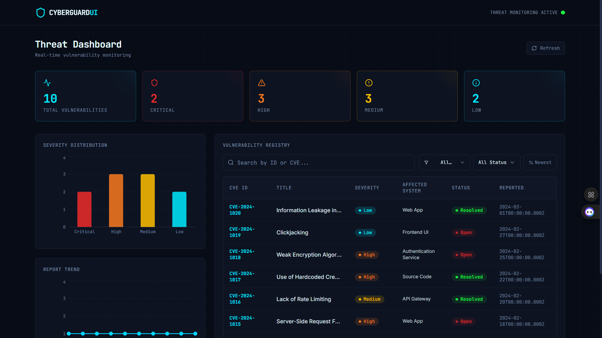

# CyberGuard - Vulnerability Management Dashboard



## 📌 Project Overview

**CyberGuard** is a full-stack, enterprise-grade vulnerability management system designed to centralize, visualize, and track security threats. It provides security teams with a robust interface to monitor Common Vulnerabilities and Exposures (CVEs), manage remediation workflows, and maintain a real-time ledger of an organization's security posture.

The system replaces fragmented tracking methods (spreadsheets, emails) with a unified, meaningful dashboard that highlights critical threats and tracks resolution progress.

### 🚀 Key Features

*   **Centralized Vulnerability Registry:** ACID-compliant storage for all CVEs.
*   **Real-time Dashboard:** Visual breakdown of threats by severity (Critical, High, Medium, Low).
*   **Workflow Management:** Track status from **Open** to **Resolved** with strict state enforcement.
*   **Advanced Filtering:** Server-side filtering and pagination for managing large datasets.
*   **Responsive Design:** Fully optimized for desktop and tablet usage.
*   **RESTful API:** Clean, documented API endpoints for integration.

---

## 🛠️ Technology Stack

### Frontend
*   **React (v18):** Component-based UI architecture.
*   **Vite:** Ultra-fast build tool and dev server.
*   **TypeScript:** Strict type safety sharing interfaces with the backend.
*   **Tailwind CSS:** Utility-first styling for a modern, responsive design.
*   **Axios:** Promise-based HTTP client with interceptor support.

### Backend
*   **Node.js:** Event-driven runtime for scalable I/O.
*   **Express.js:** Robust routing and middleware framework.
*   **MongoDB:** NoSQL database for flexible document storage.
*   **Mongoose:** ODM for schema validation and business logic enforcement.

---

## 🏗️ Architecture

The project follows a **Three-Tier Architecture**:

1.  **Presentation Tier (`/frontend`):** React SPA handling view logic.
2.  **Application Tier (`/backend`):** Node.js API handling business rules.
3.  **Data Tier (MongoDB):** Persistent storage layer.

### Folder Structure
```bash
cyberguard-dashboard/
├── assets/                 # Project screenshots
├── backend/                # API & Database logic
│   ├── config/             # DB connection
│   ├── controllers/        # Request handlers
│   ├── middleware/         # Error handling
│   ├── models/             # Mongoose schemas
│   ├── routes/             # API routes
│   └── server.js           # Entry point
├── frontend/               # React Application
│   ├── src/
│   │   ├── components/     # Reusable UI components
│   │   ├── pages/          # View controllers
│   │   └── services/       # API integration
│   └── vite.config.ts      # Build config
└── README.md               # Documentation
```

---

## ⚙️ Setup Instructions

### Prerequisites
*   Node.js (v16+)
*   MongoDB (Local or Atlas)

### 1. Backend Setup

 Navigate to the backend directory:
```bash
cd backend
```

 Install dependencies:
```bash
npm install
```

 Configure Environment Variables:
Create a `.env` file in the `backend` root:
```env
PORT=5000
MONGO_URI=mongodb://127.0.0.1:27017/cyberguard
NODE_ENV=development
```

 Seed the Database (Optional):
Populate the DB with initial test data:
```bash
npm run seed
```

 Start the Server:
```bash
npm run server
```
*Server runs on http://localhost:5000*

### 2. Frontend Setup

 Navigate to the frontend directory:
```bash
cd frontend
```

 Install dependencies:
```bash
npm install
```

 Start the Development Server:
```bash
npm run dev
```
*Frontend runs on http://localhost:8080 (or next available port)*

---

## 🔒 Security & Performance

*   **Input Validation:** Strict Mongoose schema validation prevents data corruption.
*   **Error Handling:** Centralized middleware ensures no stack traces leak in production.
*   **Security Headers:** Helmet.js integrated for HTTP header hardening.
*   **Scalability:** Implements server-side pagination to handle large datasets efficiently.

---

## 📄 License

This project is licensed under the MIT License - see the [LICENSE](LICENSE) file for details.
